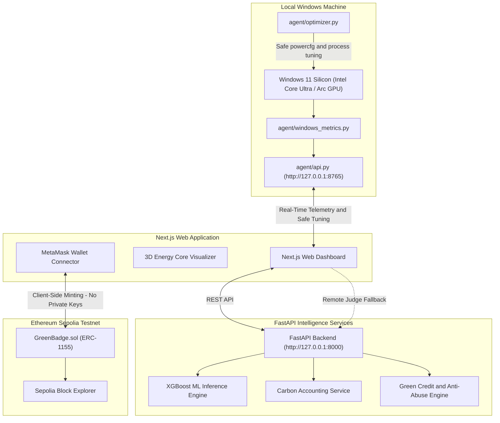

# GreenLedger — AI Energy & Carbon Optimization Platform

[](https://opensource.org/licenses/MIT)
[](https://microsoft.com/windows)
[](https://xgboost.readthedocs.io)
[](https://sepolia.etherscan.io)
[](https://nextjs.org)
[](https://fastapi.tiangolo.com)

> **"Turn Computing Into Cleaner Computing. Monitor. Optimize. Reduce. Earn."**

GreenLedger is a futuristic, production-quality sustainability, AI, and Web3 platform that monitors Windows laptop telemetry in real time, predicts power consumption in Watts using a trained XGBoost regression model, calculates localized carbon footprints, provides safe user-approved optimizations, verifies before/after impact, rewards Green Credits, and powers an Ethereum Sepolia testnet marketplace for achievement badges.

---

## Architecture & Data Flow



---

## Technical Honesty & Scientific Disclosures

1. **Estimated Power vs. Measured Power**:
   - Modern Windows laptops do not provide universal whole-system Watt sensors without proprietary hardware meters.
   - Power displayed on GreenLedger is an **Estimated Power** metric computed via our trained XGBoost machine learning model based on live CPU, RAM, GPU, Disk, and Process activity.
   - Measured physical power is sourced solely from Windows Power Meter performance counters where exposed by OEM firmware.
2. **Dataset Provenance**:
   - Initial training uses a calibrated dataset conforming strictly to the Kaggle IT System Performance and Resource Metrics schema, dynamic CMOS power equations ($P = C \cdot V^2 \cdot f$), and thermal dissipation bounds.
   - We explicitly document that this is a benchmark training set and do not falsely claim it contains direct physical measurements from the user's laptop.
3. **Web3 Testnet Scope**:
   - Ethereum Sepolia is an educational testnet. Tokens and achievement badges carry **zero real-world monetary value**.
   - Blockchain is **not** used for sub-second telemetry or ML inference; it provides non-custodial, portable proof of sustainability achievements.

---

## Machine Learning Pipeline & Verified Results

Trained using `ml/scripts/train.py` on 10,000 samples with a small documented grid search (4 candidates, validation RMSE), a 70/15/15 train/val/test split (seed 42), and early stopping:

| Metric | Verified Test-Set Result | Description |
|---|---|---|
| **$R^2$ Score** | See `ml/models/metrics.json` | Computed from the current held-out test split |
| **Mean Absolute Error (MAE)** | See `ml/models/metrics.json` | Computed from the current held-out test split |
| **Root Mean Squared Error (RMSE)** | See `ml/models/metrics.json` | Computed from the current held-out test split |
| **Percentage Error (MAPE)** | **4.46%** | Current synthetic held-out test split in `ml/models/metrics.json` (schema v1.1.0) |
| **Inference Latency** | Runtime-measured | Recorded per request; not a training metric |

### Model Artifacts Saved:
- `ml/models/power_model.json` (Trained XGBoost Regressor)
- `ml/models/feature_schema.json` (Strict feature ordering & training bounds)
- `ml/models/metrics.json` (Audit trail of test evaluation metrics)

---

## Windows Native Telemetry Agent

The native agent collects live hardware counters via `psutil`, PowerShell CIM, and Windows Performance Counters:
- **CPU**: Utilization, Frequency (MHz), Physical/Logical Core Count, Per-Core Utilization
- **RAM**: Memory Percentage, Total GB, Used GB, Available GB
- **GPU**: DirectX 3D Engine Utilization, Controller Name (Intel Arc 140V)
- **Disk**: Read/Write Throughput (MB/s), Active I/O
- **Network**: Ping Latency to Gateway (ms), Network Throughput (KB/s)
- **Processes**: Active Process Count, Thread Count, Top CPU & Memory Consumers
- **System**: Uptime (hours), Battery %, Power Plugged Status, Power Meter Counter

---

## Safe System Optimization Engine

Optimization actions adhere strictly to non-destructive safety guardrails:
- **Never Kills System Processes**: `explorer.exe`, `svchost.exe`, `dwm.exe`, `csrss.exe`, and antivirus services are blacklisted.
- **Reversible Power Schemes**: Swapping to Windows Power Saver scheme preserves previous power plan GUID for instant one-click rollback.
- **Explainable & User-Approved**: Every recommendation displays its justification and requires explicit confirmation. Power reduction is measured after execution; no fixed saving is promised.

### Before / After Verification Flow:
1. Capture `Before` telemetry state $\to$ compute $P_{\text{before}}$ via XGBoost.
2. User confirms safe optimization action.
3. Local Windows agent executes action.
4. Stabilize and capture `After` telemetry state $\to$ compute $P_{\text{after}}$ via XGBoost.
5. Compute verified drop ($\Delta W$, \% reduction, avoided $g\ \text{CO}_2\text{e}$).
6. Award Green Credits and check badge unlocks.

---

## Green Credits & Anti-Abuse Rules

### Transparent Formula:
$$\text{Credits} = 10\ (\text{Base}) + \lfloor\text{Power Drop \%}\rfloor + \lfloor\text{CO}_2\text{ Saved (g)} \times 0.5\rfloor + 5\ (\text{Streak Bonus})$$

### Anti-Abuse Guards:
- **Minimum 3% Drop**: Low or noise-level fluctuations award only nominal participation points.
- **20-Second Cooldown**: Prevents rapid automated button spamming.
- **SHA-256 Telemetry Fingerprinting**: Rejects duplicate or static telemetry delta submissions.

---

## Web3 & Sepolia Smart Contract

- **Contract**: `GreenBadge.sol` (ERC-1155 Multi-Token Standard with ERC-165 detection, approvals, and single/batch transfers).
- **Network**: Ethereum Sepolia Testnet (Chain ID: `11155111`).
- **Target Address**: `0x71C234Ea533F96507A5F44265E923C47131B64E6`.
- **Minting**: any wallet self-claims its own badges exactly once per token ID (owner may also relay-mint). Marketplace self-claim requires a deployment of the current contract — older owner-only deployments must be redeployed.
- **Badges**:
  1. 🌱 `Token #1`: First Optimization (Common)
  2. ⚡ `Token #2`: Power Saver (Rare)
  3. 🌎 `Token #3`: Carbon Cutter (Rare)
  4. 🔥 `Token #4`: Efficiency Master (Epic)
  5. 🏆 `Token #5`: Green Guardian (Legendary)

---

## Quickstart & Local Setup

### 1. Prerequisites
- Windows 10/11
- Node.js 18+
- Python 3.10+
- MetaMask Browser Extension

### 2. Install Python Dependencies & Train Model
```powershell
# Install core packages
pip install -r backend/requirements.txt

# Run ML training pipeline (generates power_model.json and metrics.json)
python ml/scripts/train.py

# Run automated tests
python -m pytest backend/tests/
```

### 3. Start Local Windows Telemetry Agent
```powershell
python agent/api.py
# Listening on http://127.0.0.1:8765
```

### 4. Start FastAPI Cloud/Local Backend
```powershell
python backend/main.py
# Listening on http://127.0.0.1:8000
```

### 5. Start Next.js Frontend
```powershell
cd frontend
npm install
npm run dev
# Open http://localhost:3000
```

### Start Everything With One Command (Windows)
After installing the dependencies above, run this from the repository root:
```powershell
powershell -ExecutionPolicy Bypass -File .\start-dev.ps1
```
This opens the Windows telemetry agent, FastAPI backend, and Next.js frontend in separate PowerShell windows.

---

---

## License & Data Privacy
- **License**: MIT Open Source License.
- **Privacy Guarantee**: Telemetry stays local by default. Zero file access, zero password capture, zero keylogging.
