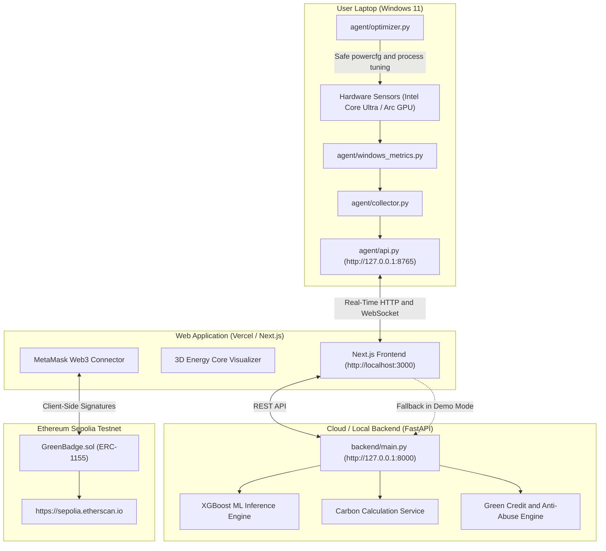

# GreenLedger — System Architecture Documentation

## Executive Overview
GreenLedger is a hybrid local/cloud sustainable computing platform that bridges native Windows 11 hardware telemetry with physics-calibrated machine-learning inference, carbon accounting, and decentralized Web3 credentials on Ethereum Sepolia.

---

## High-Level System Architecture

---

## Architectural Principles

### 1. Separation of Concerns & Browser Sandbox Realism
Web browsers cannot access arbitrary operating system hardware counters directly due to browser security sandbox constraints. Rather than faking telemetry in the browser, GreenLedger implements a native Windows background agent running on `http://127.0.0.1:8765`.

### 2. Dual-Mode Operational Flexibility
- **Live Device Mode**: The Next.js frontend queries the local agent at `http://127.0.0.1:8765` for actual Intel processor and system counters.
- **Demo Mode**: If the dashboard is opened by remote hackathon judges on macOS, Linux, or mobile devices where the agent is not installed, the platform seamlessly switches to a deterministic, realistic simulated telemetry stream clearly labeled as **"Demo Mode (Simulated)"**.

### 3. Off-Chain Heavy Compute, On-Chain Ownership
- Real-time telemetry, preprocessing, XGBoost inference, and optimization execution remain 100% off-chain for microsecond latency and zero gas costs.
- The Ethereum Sepolia blockchain is utilized strictly for **non-custodial achievement verification** via OpenZeppelin ERC-1155 tokens.
